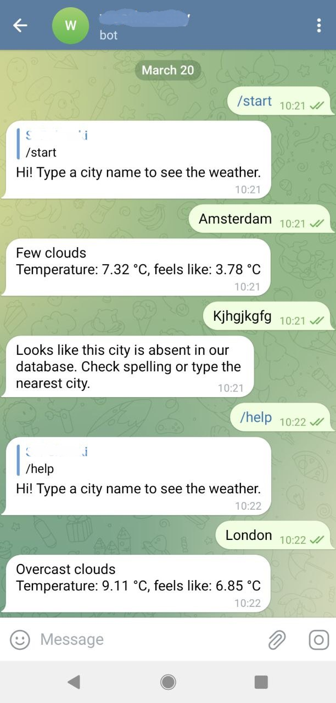

# Overview

This is the code for a Telegram Bot sending the current weather for a given city.
The weather data is taken via the OpenWeather API.

# Project Structure

* `weather.py` - functions to obtain weather data.
* `bot.py` - the main Bot module.

# Result

This is how the Bot's work look like:

